# Praksa:

---
### Vprašanje:

Najmanj koliko ocen boš dobil pri predmetu kot celoti v posameznem ocenjevalnem obdobju. Torej najmanj koliko ocen bo potrebnih v redovalnici v eAsistentu v posameznem ocenjevalnem obdobju, da se ti bo lahko zaključila končna ocena za spričevalo? Mišljene so ocene tako pri teoriji, kot pri praksi. Odgovoriti moraš z vnosom ene številke. Zapiši kot število, ne kot besedo s črkami. Pravilna je samo ena številka!
### Odgovor:
```
 3
```

---
### Vprašanje:

Kateri kriterij bo veljal za pridobitev ocene v posameznem ocenjevalnem obdobju za sprotne zagovore vaj pri praksi?
### Odgovor:
```
Na voljo je 100 točk. Kriterij: do 50t nzd(1), 50t zd(2), 65t db(3), 80t pd(4), 90t odl(5)
```

---
_vprašanje:_
```
Da boš posledično ob koncu ocenjevalnega obdobja pozitiven pri praksi kot celoti moraš biti... Izberi vse ustrezne trditve?
```
_odgovor:_
```
Pozitivno ocenjen samo pri praksi.
```

---
_vprašanje:_
```
Prikažite gostoto prebivalstva za Slovenijo. V glavi stolpca naj piše: Gostota prebivalstva za Slovenijo.
```
_odgovor:_
```
SELECT prebivalstvo/površina AS 'Gostota prebivalstva za Slovenijo' FROM države WHERE država = 'Slovenija';
```

---
_vprašanje:_
```
Izpišite imena vseh držav, ki so velike med 10.000 in 30.000 km2. Spisek uredite po abecednem vrstnem redu naraščajoče.
```
_odgovor:_
```
SELECT država FROM države WHERE površina BETWEEN 10000 AND 30000 ORDER BY država;
```

---
_vprašanje:_
```
Izpišite vse podatke za Slovenijo in Avstrijo.
```
_odgovor:_
```
SELECT * FROM države WHERE država='Slovenija' OR država='Avstrija';
```
```
SELECT * FROM države WHERE država IN ('Slovenija', 'Avstrija');
```

---
_vprašanje:_
```
Izpišite vse podatke o državah, katerih ime se prične s črko H.
```
_odgovor:_
```
SELECT * FROM države WHERE država LIKE 'H%';
```

---
_vprašanje:_
```
Izpišite vse podatke iz tabele države.
```
_odgovor:_
```
SELECT * FROM države;
```

---
_vprašanje:_
```
Izpišite imena vseh držav.
```
_odgovor:_
```
SELECT država FROM države;
```

---
_vprašanje:_
```
Prikažite gostoto prebivalstva za Italijo. V glavi stolpca naj piše: Gostota prebivalstva za Italijo.
```
_odgovor:_
```
SELECT prebivalstvo/površina AS 'Gostota prebivalstva za Italijo' FROM države WHERE država = 'Italija';
```

---
_vprašanje:_
```
Izpišite vse podatke o državah, katerih ime se ne prične s črko A.
```
_odgovor:_
```
SELECT * FROM države WHERE država NOT LIKE 'A%';
```

---
_vprašanje:_
```
Izpišite imena in površino vseh držav, ki so večje od 300.000 km2. Spisek uredite naraščajoče po velikosti držav.
```
_odgovor:_
```
SELECT država, površina FROM države WHERE površina > 300000 ORDER BY površina;
```

---
_vprašanje:_
```
Kateri SQL ukaz je avtor uporabil za rešitev prikazane naloge, oziroma katere izmed prikazanih poizvedb (A, B, C, D) vrne rezultat, ki je prikazan na sliki? Pazi, naloga je tipa izberi vse pravilne!
```
```
Kateri SQL ukaz je avtor uporabil za rešitev prikazane naloge, oziroma katere izmed prikazanih poizvedb (A, B, C, D) vrnejo rezultat, ki je prikazan na sliki?
```
_odgovor:_

> [!WARNING]  
> POGLEJ SLIKO

```
SQL_Naloga_1 | poizvedbo A

SQL_Naloga_2 | poizvedbo B

SQL_Naloga_3 | poizvedbo C

SQL_Naloga_4 | poizvedbo D
```

---
_vprašanje:_
```
Najmanj koliko ocen boš dobil pri praksi v posameznem ocenjevalnem obdobju, kot končno oceno za sprotno tedensko preverjanje znanja, ki ga bomo poimenovali kar sprotni zagovori vaj? Odgovoriti moraš z vnosom ene številke. Zapiši kot število, ne kot besedo s črkami. Pravilna je samo ena številka!
```
_odgovor:_
```
1
```

---
_vprašanje:_
```
Koliko rezerviranih besed jezika SQL (torej koliko ključnih besed jezika SQL) je uporabljenih v splošni obliki zapisa (sintaksa ukaza) ukaza SELECT za povezovanje z ukazom JOIN? (Znak za enačaj ne štejemo kot ključno besedo!) Odgovoriti moraš z vnosom ene številke. Zapiši kot število, ne kot besedo s črkami. Pravilna je samo ena številka!
```
_odgovor:_
```
4
```

---
_vprašanje:_
```
Koliko rezerviranih besed jezika SQL (torej koliko ključnih besed jezika SQL) je uporabljenih v splošni obliki zapisa (sintaksa ukaza) ukaza SELECT za povezovanje z enačajem? (Znak za enačaj ne štejemo kot ključno besedo!) Odgovoriti moraš z vnosom ene številke. Zapiši kot število, ne kot besedo s črkami. Pravilna je samo ena številka!
```
_odgovor:_
```
3
```

---
_vprašanje:_
```
Imamo dve tabeli, ki sta povezani preko ustreznih dveh polj. Izberi vse ustrezne trditve? Pazi, točke dobiš le za nalogo z vsemi pravilnimi rešitvami.
```
_odgovor:_

> [!WARNING]
> VEČ NALOG Z ISTIM VPRAŠANJEM, IMA 2 ODGOVORA

```
SQL SELECT ukaz, kjer uporabimo povezovanje z LEFT JOIN nam vrne največje število vrstic
```
```
SQL SELECT ukaz, kjer uporabimo povezovanje z enačajem nam lahko vrne enako število vrstic, kot če uporabimo povezovanje z LEFT JOIN
```
```
SQL SELECT ukaz, kjer uporabimo povezovanje z LEFT JOIN lahko vedno enakovredno zamenjamo z enakovrednim ukazom z RIGHT JOIN
```
```
SQL SELECT ukaz, kjer uporabimo povezovanje z RIGHT JOIN lahko vedno enakovredno zamenjamo z enakovrednim ukazom z LEFT JOIN
```

---
_vprašanje:_
```
Besedilo Vaje7: podan program, ki izpiše prve tri stoplce iz tabele Artikel v podani bazi spremni tako, da: 1. Izpiše vse podatke iz tabel Račun, Postavka in Artikel. (Opomba: Besedilo Vaje 13 za 15 teden v spodnji nalogi beri kot "Besedilo Vaje 7".)
```
_odgovor:_
```
3
```

---
_vprašanje:_
```
Besedilo Vaje 7: podan program, ki izpiše prve tri stoplce iz tabele Artikel v podani bazi spremni tako, da: 1. Izpiše vse podatke iz tabel Račun, Postavka in Artikel. (Opomba: Besedilo Vaje 13 za 15 teden v spodnji nalogi beri kot "Besedilo Vaje 7".)
```
_odgovor:_
```
1
```

---
# Teorija:

---
_vprašanje:_
```
Kateri kriterij bo veljal za pridobitev ocene v posameznem ocenjevalnem obdobju za sprotno preverjanje znanja pri teoriji?
```
_odgovor:_
```
Nobeden izmed naštetih
```

---
_vprašanje:_
```
Najmanj koliko ocen boš dobil pri predmetu kot celoti v posameznem ocenjevalnem obdobju. Torej najmanj koliko ocen bo potrebnih v redovalnici v eAsistentu, da se ti bo lahko zaključila končna ocena za spričevalo? Mišljene so ocene tako pri teoriji, kot pri praksi. Odgovoriti moraš z vnosom ene številke. Zapiši kot število, ne kot besedo s črkami. Pravilna je samo ena številka!
```
_odgovor:_
```
3
```

---
_vprašanje:_
```
Vnesi angleško kratico za pojem "Jezik za rokovanje s podatki". Odgovoriti moraš z vnosom samih v velikih črk. Zapiši kot kratico s samimi velikimi črkami!
```
_odgovor:_
```
DML
```

---
_vprašanje:_
```
Kaj pomeni kratica BNF?
```
_odgovor:_
```
Backus–Naur form (often used to describe the syntax of languages used in computing)
```

---
_vprašanje:_
```
Koliko stolpcev je v rezultatu naslednjega ukaza? SELECT EmployeeID AS Zaposleni, COUNT(*) AS 'Število naročil' FROM Orders GROUP BY EmployeeID; Odgovoriti moraš z vnosom ene številke. Zapiši kot število, ne kot besedo s črkami. Pravilna je samo ena številka!
```
_odgovor:_
```
2
```

---
_vprašanje:_
```
Katere trditve držijo za udeležbo pri šolskih urah, ki se izvajajo v računalniških učilnicah?
```
_odgovor:_
```
VSI ODGOVORI
```

---
_vprašanje:_
```
Izpišite imena in površino vseh držav, ki so manjše od 300.000 km2. Spisek uredite naraščajoče po velikosti držav.
```
_odgovor:_
```
SELECT država, površina FROM države WHERE površina < 300000 ORDER BY površina;
```

---
_vprašanje:_
```
Izpišite vse podatke o državah, katerih ime se prične s črko A ali s črko H.
```
_odgovor:_
```
SELECT * FROM države WHERE država LIKE 'A%' OR država LIKE 'H%'
```

---
_vprašanje:_
```
Prikažite ime države in gostoto prebivalstva za Slovenijo in Italijo. V glavi drugega stolpca naj piše: Gostota prebivalstva.
```
_odgovor:_
```
SELECT država, prebivalstvo/površina AS 'Gostota prebivalstva' FROM države WHERE država = 'Italija' OR država = 'Slovenija';
```

---
_vprašanje:_
```
Koliko je vseh kosov v naročilu?? Izberi vse pravilne rešitve.
```
_odgovor:_
```
SELECT SUM(kosi) FROM naročilo;
```

---
_vprašanje:_
```
Koliko je različnih vrst izdelkov? Izberi vse pravilne rešitve.
```
_odgovor:_
```
SELECT COUNT(DISTINCT vrsta_izdelka) FROM naročilo
```

---
_vprašanje:_
```
Koliko je zapisov v tabeli naročilo? Izberi vse pravilne rešitve.
```
_odgovor:_
```
SELECT COUNT(*) FROM naročilo;
```
```
SELECT COUNT(ime_izdelka) FROM naročilo;
```

---
_vprašanje:_
```
Koliko različnih oblik SELECT ukaza za povezovanje tabel je opisanih v gradivu? Odgovoriti moraš z vnosom ene številke. Zapiši kot število, ne kot besedo s črkami. Pravilna je samo ena številka!
```
_odgovor:_
```
3
```

---
_vprašanje:_
```
Izberi vse pravilne trditve. (LEFT JOIN)
```
_odgovor:_
```
LEFT JOIN nam vrne tudi tiste zapise iz »leve« tabele, ki nimajo povezave z »desno« tabelo.
```
```
LEFT JOIN nam vrne tudi vse zapise iz »leve« tabele.
```
```
LEFT JOIN nam vrne tudi tiste zapise iz »desne« tabele, ki imajo povezavo z »levo« tabelo.
```
```
LEFT JOIN nam vrne vse zapise iz »leve« tabele in samo tiste zapise iz »desne« tabele, ki imajo povezavo z »levo« tabelo.
```
```
Rezultat leve zunanje združitve vrne enako ali več vrstic, kot rezultat notranje združitve.
```
```
Možno je, da rezultat leve zunanje združitve vrne enako vrstic, kot rezultat notranje združitve.
```
```
Možno je, da rezultat leve zunanje združitve vrne enako vrstic, kot rezultat desne zunanje združitve.
```

---
_vprašanje:_
```
Ali stavek SELECT omogoča, da povežemo dve tabeli?
```
_odgovor:_
```
DA
```

---
_vprašanje:_
```
Izberi vse pravilne trditve. (RIGHT JOIN)
```
_odgovor:_
```
RIGHT JOIN nam vrne tudi vse zapise iz »desne« tabele.
```
```
RIGHT JOIN nam vrne tudi tiste zapise iz »leve« tabele, ki imajo povezavo z »desno« tabelo.
```
```
RIGHT JOIN nam vrne vse zapise iz »desne« tabele in samo tiste zapise iz »leve« tabele, ki imajo povezavo z »ldesno« tabelo.
```
```
Rezultat desne zunanje združitve vrne enako ali več vrstic, kot rezultat notranje združitve.
```
```
Možno je, da rezultat desne zunanje združitve vrne enako vrstic, kot rezultat notranje združitve.
```
```
Možno je, da rezultat desne zunanje združitve vrne enako vrstic, kot rezultat leve zunanje združitve.
```

---
_vprašanje:_
```
Ali stavek SELECT omogoča, da povežemo več kot dve tabeli?
```
_odgovor:_
```
DA
```

---
_vprašanje:_
```
Izberi vse pravilne trditve. (SHORT)
```
_odgovor:_
```
Če zamenjamo vrstni red tabel, lahko prevedemo RIGHT JOIN v LEFT JOIN in obratno.
```
```
Če želimo, lahko prevedemo LEFT JOIN v RIGHT JOIN.
```
```
Če želimo, lahko prevedemo RIGHT JOIN v LEFT JOIN.
```

---
_vprašanje:_
```
Kateremu besedilu ustreza prikazan SQL ukaz?
```
_odgovor:_

> [!WARNING] 
> VPRAŠANJA IMAJO ENAKO IME, GLEJ SLIKICE

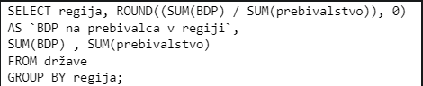
`SELECT regija, ROUND((SUM(BDP) / SUM(prebivalstvo)), 0)`
```
Kolikšen je BDP na prebivalca v posamezni regiji?
```

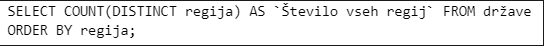
``SELECT COUNT(DISTINCT regija) AS `Število vseh regija` FROM države``
```
Koliko je vseh regij? Stolpec poimenujte: Število vseh regij
```

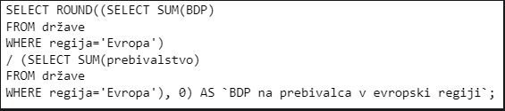
`SELECT ROUND((SELECT SUM(BDP)`
```
Kolikšen je BDP na prebivalca v evropski regiji?
```

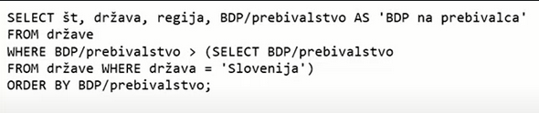
`SELECT št, država, regija, BDP/prebivalstvo AS 'BDP na prebivalca'`
```
Izpiši št, državo, regijo in BDP na prebivalca za vse države, ki imajo višji BDP na prebivalca od Slovenije. Prikazane naj bodo od naraščajoče po BDP na prebivalca.
```

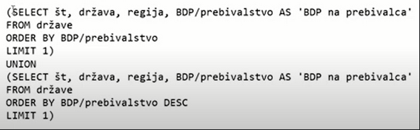
`(SELECT št, država, regija, BDP/prebivalstvo AS 'BDP na prebivalca'`
```
Izpiši št, državo, regijo in BDP na prebivalca za državo z najnižjim in za državo z najvišjim BDP na prebivalca (prikazani naj bosta v navedenem vrstnem redu).
```

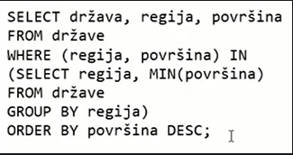
`SELECT država, regija, površina`
```
Izpiši državo, regijo in površino najmanjše države v vsaki regiji. Prikazane naj bodo od največje do najmanjše.
```

---
_vprašanje:_
```
Kaj naredi naslednji SQL ukaz?
```
_odgovor:_

> [!WARNING] 
> VPRAŠANJA IMAJO ENAKO IME, GLEJ SLIKICE

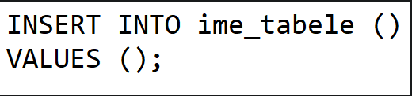
`INSERT INTO ime_tabele () VALUES ();`
```
če je to mogoče, vstavi novo vrstico in nastavi vrednosti na privzete vrednosti
```

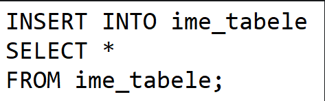
`INSERT INTO ime_tabele SELECT * FROM ime_tabele; `
```
če je to mogoče, podvoji vse zapise v tabeli
```

---
_vprašanje:_
> [!WARNING] 
> V DOKUMENTU STA DVE ENAKI VPRAŠANJI, POGLEJ SLIKE TUDI DRUGEGA, ALI IŠČI PO KOTEKSTU SLIKE
```
Vnesi besede, ki sestavljajo odgovor. Seveda je pomemben vrstni red besed in velikost črk. Ločiš jih vedno s samo enim presledkom med besedami. Presledkov na začetku in koncu ne sme biti.
```
_odgovor:_

> [!WARNING] 
> VPRAŠANJA IMAJO ENAKO IME, GLEJ SLIKICE. TO JE DEL TEORIJE, JAVA IMA SVOJ DEL

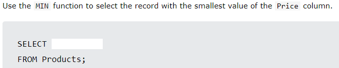
`Use the MIN function to select the record with the smallest value of the Price column.`
```
MIN (Price)
```

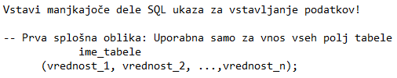
`Vstavi manjkajoče dele SQL ukaza za vzstavljanje podatkov! Prva splošna oblika:`
```
INSERT INTO VALUES
```

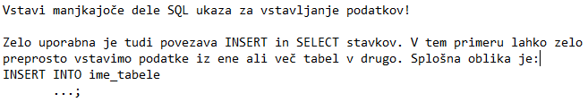
`Vstavi manjkajoče dele SQL ukaza za vzstavljanje podatkov! Zelo uporabna je tudi povezava INSERT in SELECT stavkov.`
```
SELECT
```

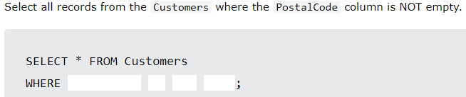
`Select all records from the Customers where the PostalCode column is NOT empty.`
```
PostalCode IS NOT NULL
```

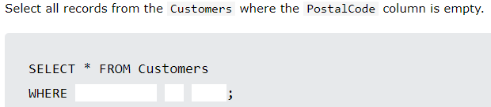
`Select all records from the Customers where the PostalCode column is empty.`
```
PostalCode IS NULL
```

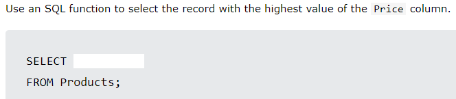
`Use an SQL function to select the record with the highest value of the Price column.`
```
MAX (Price)
```

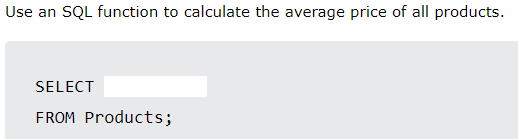
`Use an SQL function to calculate the average price of all products.`
```
AVG (Price)
```

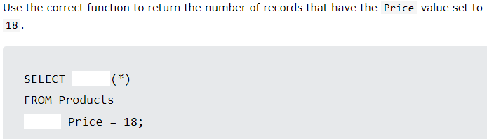
`Use the correct function to return the number of records that have the Price value set to 18.`
```
COUNT WHERE
```

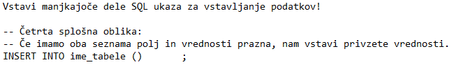
`stavi manjkajoče dele SQL ukaza za vzstavljanje podatkov! Četrta splošna oblika:`
```
VALUES ()
```

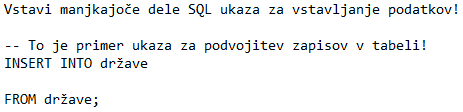
`stavi manjkajoče dele SQL ukaza za vzstavljanje podatkov! To je primer ukaza za podvojitev zapisov v tabeli!`
```
SELECT *
```

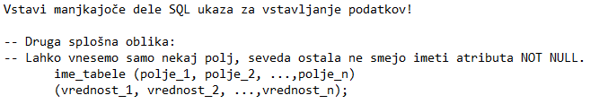
`stavi manjkajoče dele SQL ukaza za vzstavljanje podatkov! Druga splošna oblika:`
```
INSERT INTO VALUES
```

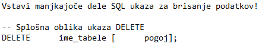
`stavi manjkajoče dele SQL ukaza za brisanje podatkov! Splošna oblika ukaza DELETE`
```
FROM WHERE
```

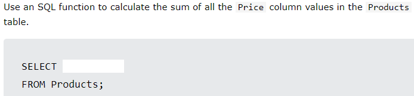
`Use an SQL function to calculate the sum of all the Price column values in the Products table.`
```
SUM (Price)
```

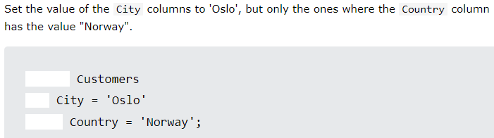
`Set the value of the City column to 'Oslo', but only the ones where the Country column has the value "Norway".`
```
UPDATE SET WHERE
```

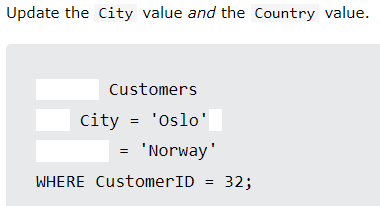
`Update the City value and the Country value.`
```
UPDATE SET , Country
```

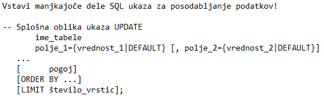
`stavi manjkajoče dele SQL ukaza za posodabljanje podatkov! Splošna oblika ukaza UPDATE`
```
UPDATE SET WHERE
```

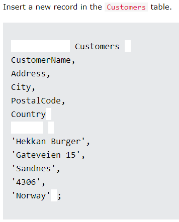
`Insert a new record in the Customers table.`
```
INSERT INTO ( ) VALUES ( )
```

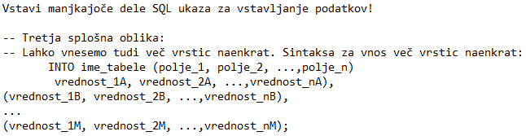
`stavi manjkajoče dele SQL ukaza za vzstavljanje podatkov! Tretja splošna oblika:`
```
INSERT VALUES (
```

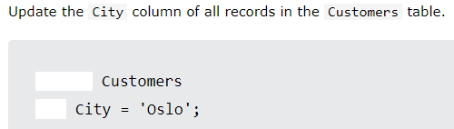
`Update the City column of all records in the Customers table.`
```
UPDATE SET
```

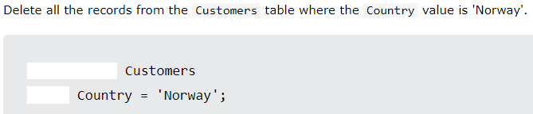
`Delete all the records from the Customers table where the Country value is 'Norway'.`
```
DELETE FROM WHERE
```

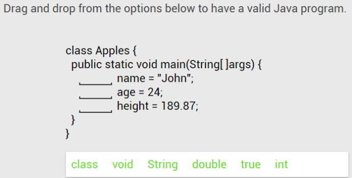
`Drag and drop from the options below to have a valid Java program.`
```
String int double
```

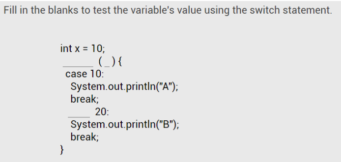
`Fill in the blanks to test the variable's value using the switch statement.`
```
switch x case
```

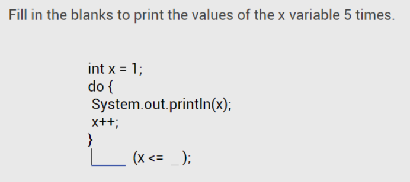
`Fill in the blanks to print the values of the x variable 5 times.`
```
while 5
```

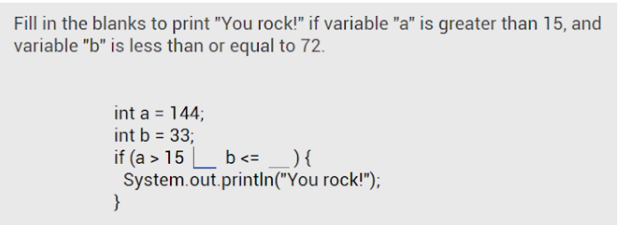
`Fill in the blanks to print "You rock!" if variable "a" is greater than 15, and variable "b" is less than or equal to 72.`
```
&& 72
```

---
# Java:

---
_vprašanje:_
```
Da boš posledično ob koncu ocenjevalnega obdobja pozitiven pri predmetu kot celoti moraš biti... Izberi vse ustrezne trditve?
```
_odgovor:_
```
Pozitivno ocenjen vsaj pri pisnem preizkusu znanja.
```

---
_vprašanje:_
```
Najmanj koliko ocen boš dobil pri predmetu v posameznem ocenjevalnem obdobju, kot končno oceno za sprotno tedensko preverjanje znanja? Odgovoriti moraš z vnosom ene številke. Zapiši kot število, ne kot besedo s črkami. Pravilna je samo ena številka!
```
_odgovor:_
```
1
```

---
_vprašanje:_
```
Najmanj koliko ocen boš dobil pri predmetu kot celoti v posameznem ocenjevalnem obdobju. Torej najmanj koliko ocen bo potrebnih v redovalnici v eAsistentu, da se ti bo lahko zaključila končna ocena za ocenjevalno obdobje kot pozitivna? Odgovoriti moraš z vnosom ene številke. Zapiši kot število, ne kot besedo s črkami. Pravilna je samo ena številka!
```
_odgovor:_
```
2
```

---
_vprašanje:_
```
Kateri kriterij bo veljal za pridobitev ocene v posameznem ocenjevalnem obdobju pri pisnem preverjanju znanja?
```
_odgovor:_
```
Na voljo je 100 točk. Kriterij: do 50t nzd(1), 50t zd(2), 65t db(3), 80t pd(4), 90t odl(5)
```

---
_vprašanje:_
```
Ali si komentarji obvezni?

Ali so komentarji obvezni?
```
_odgovor:_
```
NE
```

---
_vprašanje:_

> [!WARNING] 
> NASLEDNJI DVE VPRAŠANJI STA SI PODOBNI PAZ, DA JE NAPISANO ČISTO ENAKO

```
Koliko vrstic izpiše program na sliki? Odgovoriti moraš z vnosom ene številke. Zapiši kot število, ne kot besedo s črkami. Pravilna je samo ena številka! Pazi! Štejejo se tudi morebitne prazne vrstice v izpisu programa.
```
_odgovor:_
```
7
```

---
_vprašanje:_
```
Koliko vrstic izpiše program na sliki? Odgovoriti moraš z vnosom ene številke. Zapiši kot število, ne kot besedo s črkami. Pravilna je samo ena številka!
```
_odgovor:_
```
3
```

---
_vprašanje:_

> [!WARNING] 
> NASLEDNJI DVE VPRAŠANJI STA SI PODOBNI PAZ, DA JE NAPISANO ČISTO ENAKO

```
Koliko spremenljivk je uporabljenih v programu na sliki? Odgovoriti moraš z vnosom ene številke. Zapiši kot število, ne kot besedo s črkami. Pravilna je samo ena številka! Argumenta metode main() ne štej za spremenljivko.
```
_odgovor:_
```
1
```

---
_vprašanje:_
```
Koliko spremenljivk je uporabljenih v programu na sliki? Odgovoriti moraš z vnosom ene številke. Zapiši kot število, ne kot besedo s črkami. Pravilna je samo ena številka!
```
```
Koliko spremenljivk je uporabljenih v programu na sliki? Argumentov metod ne štej med spremenljivke! Odgovoriti moraš z vnosom ene številke. Zapiši kot število, ne kot besedo s črkami. Pravilna je samo ena številka! Bodi pozoren na podrobnosti. Razmisli in odgovori.
```
_odgovor:_
`public class Program_v1`
```
5
```

---
_vprašanje:_
```
Izberi vse pravilne trditve. Ena sama napaka pomeni 0 točk. (GREEN FOOT)
```
_odgovor:_

> [!WARNING] 
> TUKAJ STA DVE NALOGI, KI STA SI ZELO PODOBNI, TREBA JE UPORABIT VSE MOŽNOSTI, KI JIH LAHKO V VSAKI NALOGI (NEKATERE ODGOVORE SI DELITA)

```
Michael Kölling je vodja razvojne skupine za okolje Greenfoot
```
```
Greenfoot okolje podpira razvoj programov s podporo za enostavno 2D grafiko.
```
```
Greenfoot okolje podpira razvoj objektno zasnovanih programov
```
```
The Joy Of Code je vadnica (tutorial) objektnega programiranja.
```
```
The Joy Of Code is a programming tutorial.
```
```
Greenfoot okolje podpira tako razvoj programov za enostavne igrice kot razvoj programov za enostavne simulacije
```
```
Greenfoot okolje podpira razvoj programov v programskem jeziku Java
```
```
James Gosling je vodilni oblikovalec programskega jezika Java.
```
```
Greenfoot je izobraževalno razvojno okolje, ki je specializirano za razvoj vzorčnih grafičnih programov, s poudarkom na razvoju enostavni iger in simulacij.
```
```
The Joy Of Code govori o programiranju v okolju Greenfoot z javo.
```

---
_vprašanje:_
```
Podana je naslednja naloga. Izberi vse pravilne trditve. Ena sama napaka pomeni 0 točk.
```
_odgovor:_

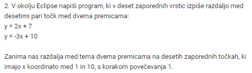
`2. V okolju Eclipse napiši program, ki v deset zaporednih vrstic izpiše razdaljo med desetimi pari točk med dvema premicama:`
```
Nalogo je mogoče rešiti z rabo zanke while.
```
```
Nalogo je mogoče rešiti tudi brez rabe zanke, vendar je taka rešitev zelo slaba.
```
```
Nalogo je mogoče rešiti z rabo zanke for.
```
```
Nalogo je mogoče rešiti z rabo zanke do while.
```

---
_vprašanje:_

> [!WARNING] 
> TUKAJ IMAMO 3 PODOBNE SLIKE NA KATERA SE NANAŠA NEKAJ VPRAŠANJ (ODGOVORI SO ZAPISANI V ENAKEM ZAPOREDJU, KOT SO NAVEDENA VPRAŠANJA)

```
Ali je ta program brez napak in bi dejansko deloval?

----------------------------------------------------------------------------------------

Koliko vrstic dejansko prebere prikazan program, če vnesemo več kot eno vrstico? Odgovoriti moraš z vnosom ene številke. Zapiši kot število, ne kot besedo s črkami. Pravilna je samo ena številka!
```
_odgovor:_
```
Poglej ali na 8. liniji piše "String userName = vnos.nextLine();", če ja potem je prav drugače je narobe. 
```
```
1
```

---
_vprašanje:_
```
Podana je naslednja koda programa. Izberi vse pravilne trditve. Ena sama napaka pomeni 0 točk. (Naloga_D3)
```
_odgovor:_

> [!WARNING] 
> NALOGA D3 IMA DVE PODOBNI SLIKI

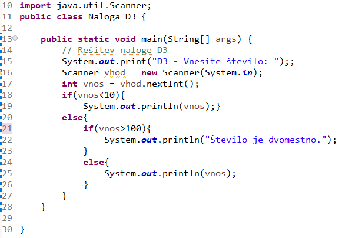
```
Če vnesemo 7 program izpiše 7
```
```
Če vnesemo 10 program izpiše 10
```
```
Če vnesemo 100 program izpiše 100
```
```
Program ima logično napako in ne deluje pravilno
```

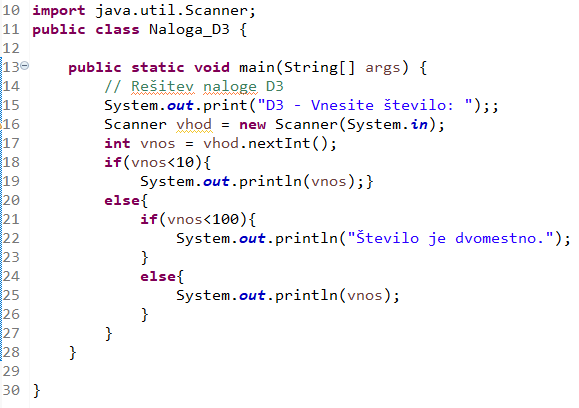
```
Če vnesemo 7 program izpiše 7
```
```
Če vnesemo 100 program izpiše 100
```

---
_vprašanje:_
```
Koliko vrstic se izpiše med izvedbo programa na sliki? Odgovoriti moraš z vnosom ene številke. Zapiši kot število, ne kot besedo s črkami. Pravilna je samo ena številka!
```
_odgovor:_

> [!WARNING] 
> POGLEJ PUBLIC CLASS (NALOGA_D1 IN NALOGA_D2)

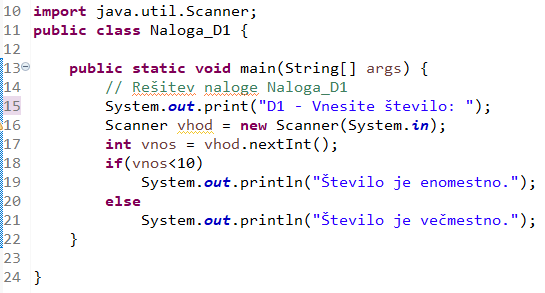
`Naloga_D1`
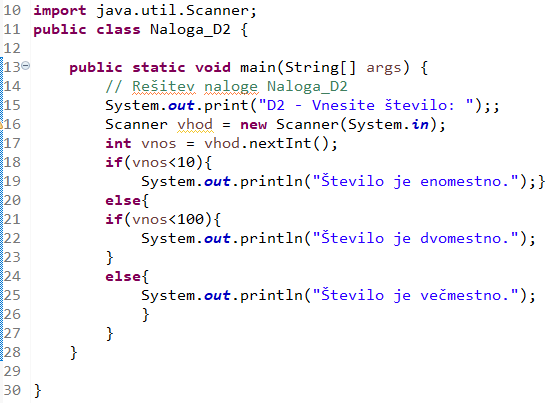
`Naloga_D2`
```
2
```

---
_vprašanje:_
```
Ali je prikazana koda programa pravilna rešitev opisanega problema?
```
_odgovor:_
```
Bot | NE

Celsius to Fahrenheit | NE

Feet to Inches Converter | NE
```

---
_vprašanje:_
> [!WARNING] 
> V DOKUMENTU STA DVE ENAKI VPRAŠANJI, POGLEJ SLIKE TUDI DRUGEGA, ALI IŠČI PO KOTEKSTU SLIKE
```
Vnesi besede, ki sestavljajo odgovor. Seveda je pomemben vrstni red besed in velikost črk. Ločiš jih vedno s samo enim presledkom med besedami. Presledkov na začetku in koncu ne sme biti.
```
_odgovor:_

> [!WARNING] 
> VPRAŠANJA IMAJO ENAKO IME, GLEJ SLIKICE. TO JE DEL JAVE, TEORIJA IMA SVOJ DEL

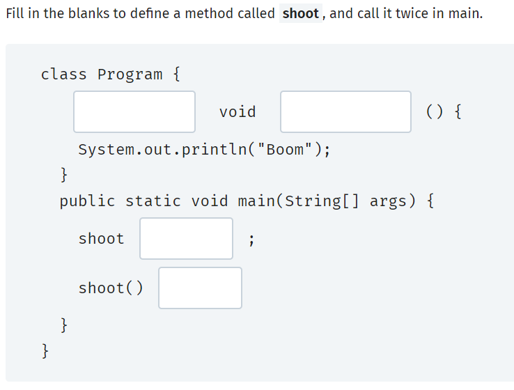
`Fill in the blanks to define a method called shoot, and call it twice in main.`
```
static shoot () ;
```

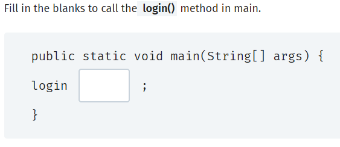
`Fill in the blanks to call the login() method in main.`
```
()
```

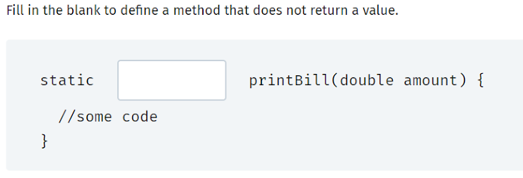
`Fill in the blank to define a method that does not return a value.`
```
void
```

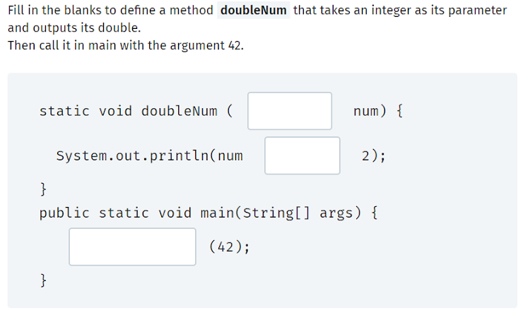
`Fill in the blanks to define a method doubleNum that takes and integer as its parameter and outputs its double.`
```
int * doubleNum
```

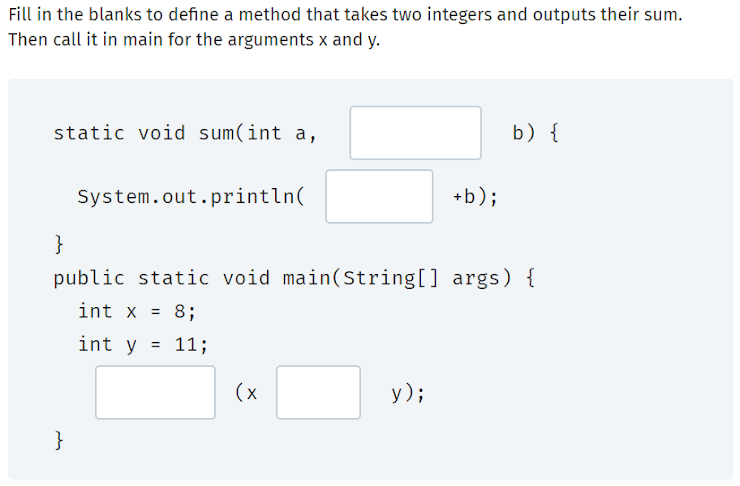
`Fill in the blanks to define a method that takes two integers and outputs their sum.`
```
int a sum ,
```

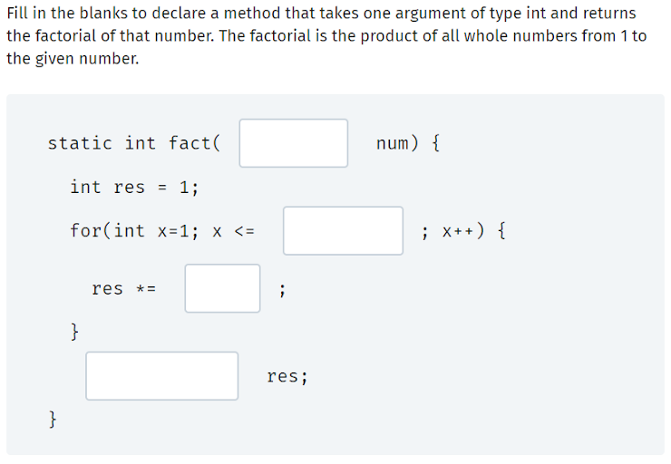
`Fill in the blanks to declare a method that takes one argument of type int and returns the factorial of that number.`
```
int num x return
```

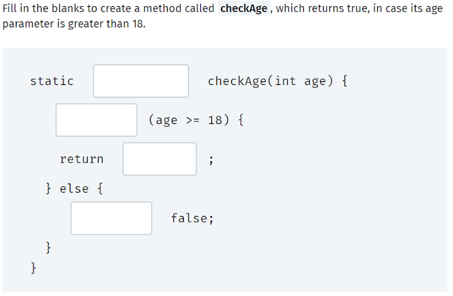
`Fill in the blanks to create a method called checkAge, which returns true, in case its age prameter is greater than 18.`
```
boolean if true return
```

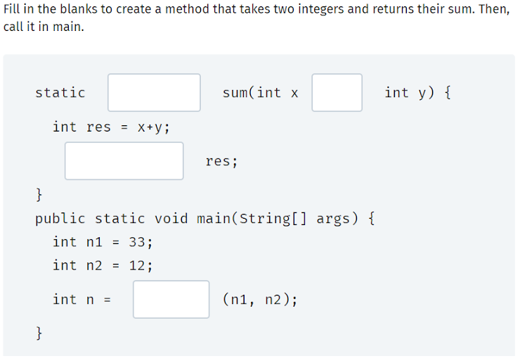
`Fill in the blanks to create a method that takes two integers and returns their sum. Then, call it in main.`
```
int , return sum
```

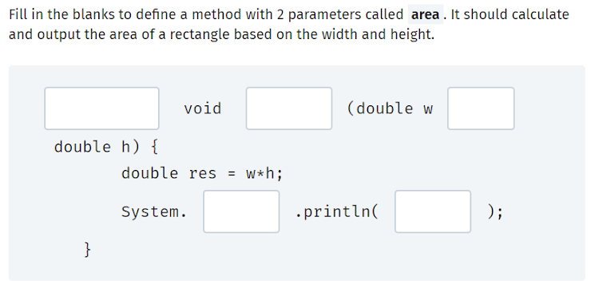
`Fill in the blanks to define a method with 2 parameters called area. It should calculate and output the area of a rectangle based on the width and height.`
```
static area , out res
```

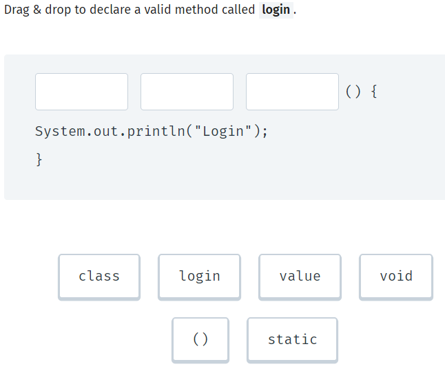
`Drag & drop to declare a valid method called login.`
```
static void login
```

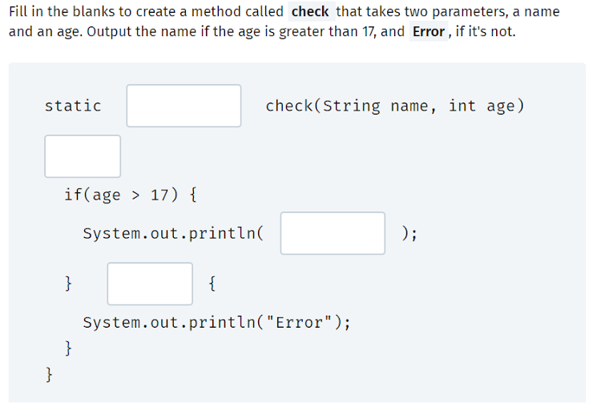
`Fill in the blanks to create a method called check that takes two parameters, a name and an age.`
```
void { name else
```

---
_vprašanje:_
```
Kaj izpiše naslednji program?
```
_odgovor:_
```
50
```

---
_vprašanje:_
```
Which of the following specifies that a method does not return any value?
```
_odgovor:_
```
void
```

---
_vprašanje:_
```
What is the return type of the following method?
```
_odgovor:_
```
String
```

---
_vprašanje:_
```
Koliko vrstic izpiše naslednji program?
```
_odgovor:_

> [!WARNING] 
> ISTO VPRAŠANJE DRUGA SLIKICA

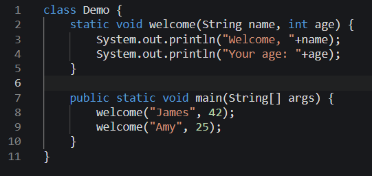
`static void welcome(String name, int age)`
```
4
```

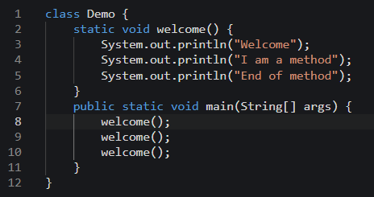
`static void welcome()`
```
9
```


`public class Program { public static void main(String[] args)`
```
7
```


`class MyClass { public static void main(String[ ] args) {`
```
1
```

---
_vprašanje:_
```
V katerih vrsticah je napaka v prikazanem programu?
```
_odgovor:_

```
3
```


```
0
```

---
_vprašanje:_
```
Vnesi pravilen odgovor!
```
_odgovor:_


`What is the result of demo(8, 3)?`
```
2
```

---
_vprašanje:_
```
V programu iz videa Java JDBC Tutorial - Part 1: Connect to MySQL database with Java je zapisan naslednji del kode. Kateri komentar mu ustreza.
```
_odgovor:_
```
// 4. Process the result set
```

---
_vprašanje:_
```
Koliko vrstic izpiše prikazan program?

Koda programa, torej razreda Beri_iz_Accessa je na posebni sliki v tem istem razdelku.
```
_odgovor:_
```
Toliko kolikor je zapisov v tabeli Artikel.
```

---
_vprašanje:_
```
Koliko stolpcev izpiše prikazan program? Torej koliko stolpcev je v izpisu prikazanega programa?

Koda programa, torej razreda Beri_iz_Accessa je na posebni sliki v tem istem razdelku.
```
_odgovor:_
```
3
```

---
_vprašanje:_
```
Kateremu besedilu ustreza prikazana SQL koda?
```


`SELECT država, regija, površina FROM države WHERE površina = (SELECT MIN(površina))`
_odgovor:_
```
Izpišite državo, regijo in površino za najmanjšo in največjo državo. Prva naj bo najmanjša.
```

---
_vprašanje:_
```
V programu iz videa Java JDBC Tutorial - Part 2: Insert Data into a MySQL Database je zapisan naslednji del kode. Kateri komentar mu ustreza.
```
_odgovor:_
```
// 4. Process the result set
```

---
_vprašanje:_
```
Besedilo Vaje 8: program, ki je rešitev prejšnje vaje (in izpiše vse podatke iz tabel Račun, Postavka in Artikel) spremeni tako, da:1. Izpiše koliko zapisov je v vsaki izmed tabel v priloženi bazi Račun 16T.accdb (Opomba: Besedilo Vaje 14 za 16 teden v spodnji nalogi beri kot "Besedilo Vaje 8".)
```
_odgovor:_
```
1
```

---
_vprašanje:_
```
Besedilo Vaje 8: program, ki je rešitev prejšnje vaje (in izpiše vse podatke iz tabel Račun, Postavka in Artikel) spremeni tako, da: 1. Izpiše koliko zapisov je v vsaki izmed tabel v priloženi bazi Račun 16T.accdb Pazi na to, koliko je vseh tabel v bazi Račun 16T.accdb (Opomba: Besedilo Vaje 14 za 16 teden v spodnji nalogi beri kot "Besedilo Vaje 8".)
```
_odgovor:_
```
5
```

---
_vprašanje:_
```
Katere ukazi vrnejo rešitev SQL_Rešitev_Vaja_15 iz prikazane slike?
```
_odgovor:_
```
c
```

---
_vprašanje:_
```
Write once, run everywhere. This slogan means that:
```
_odgovor:_
```
Java is platform-independent
```

---
_vprašanje:_
```
True or false? Java is used only to build web apps.
```
_odgovor:_
```
False
```

---
_vprašanje:_
```
Which statements are true? Choose all the correct statements!
```
_odgovor:_
```
Java's slogan is "Write once, run anywhere".
```
```
Java is one of the most popular programming languages.
```
```
You can use Java to build Android apps, games, banking applications, web apps, and much more!
```
```
The same Java code can run on different platforms, including mobile, desktop and other portable systems.
```

---
_vprašanje:_
```
Ali je naslednja koda pravilna rešitev problema Time Converter? (days = days * 3600)
```
_odgovor:_
```
To ni pravilna rešitev navedenega problema
```

---
_vprašanje:_
```
Which statement in regard to the char data type is true?
```
_odgovor:_
```
'k' is a char
```

---
_vprašanje:_
```
Dopolni naslednjo kodo, z vnosom manjkajoče kode na mestih, ki so označena s podčrtaji (________). V tem primeru je samo eno takšno mesto, sicer jih je lahko več. Pazi! Bodo pozoren na podrobnosti v izpisu programa. Izpis je v dveh vrsticah. To je bistveno za tvojo pravilno rešitev, ki je lahko samo ena. Seveda vedno velja, da ločimo velikost črk. Pazi! Pri vnosu odgovora ne sme biti odvečnih začetnih presledkov pred prvo besedo odgovora in odvečnih končnih presledkov za zadnjo besedo odgovora. Med besedami, ki sestavljajo odgovor je vedno samo en presledek. Pomembna je tudi velikost črk. Torej na kratko: presledki samo med deli odgovora in velikost črk!
```
_odgovor:_
```
println
```

---
_vprašanje:_
```
V katerih vrsticah je napaka ali vzrok za morebitne napake v prikazanem delu programa? Zanimajo nas vrstice, ki so vzrok za sintaktične napake (med prevajanjem) in/ali vrstice z logično napako (ki so vzrok za napačno delovanje programa, ki ni v sladu z navodili oziroma besedilom naloge). Glej tudi podrobnejšo razlago v glavi tega razdelka z nalogami!
```
_odgovor:_
```
povrsinaKocke | 0
prostorninaKocke | 17
```

---
_vprašanje:_
```
Kateri ukazi vrnejo rešitev SQL_Rešitev_Vaja_15 iz prikazane slike?
```
_odgovor:_
```
c
```

---
_vprašanje:_
```
Imamo program v Javi, ki je preko JDBC vmesnika povezan s podatkovno bazo Račun v Accessu. Program: 1. Izpiše koliko zapisov je v vsaki izmed tabel v podani bazi.Programer je namesto enega predmeta ResultSet (ResultSet rs) uporabil pet predmetov tipa ResultSet, kot prikazuje koda. Vse ostalo v programu (kar se ne vidi na sliki) je nespremenjeno. Program je pred tem deloval. Ali deluje tudi po prikazani spremembi?
```
_odgovor:_
```
DA
```

---
_vprašanje:_
```
Najmanj kolikokrat moramo v opisanem programu uporabiti izraz, ki ga prikazuje slika?
Imamo program v Javi, k ije preko JDBC vmesnika povezan s podatkovno bazo Račun v Accessu. Program: 1. Izpiše vse podatke iz tabel Račun, Postavka in Artikel.
```

_odgovor:_
```
3
```

---
_vprašanje:_
> [!WARNING] 
> ISTO VPRAŠANJE DRUGA SLIKICA
```
Kaj izpiše naslednji ukaz?
```
_odgovor:_
.png)
```
Koliko je zapisov v tabeli
```
_AS_'število_izdelkov'.png)
```
Koliko je izdelkov v vsaki vrsti izdelka
```
.png)
```
Prikaže vrsto izdelka za vsak izdelek
```
.png)
```
Koliko je vseh kosov v naročilu
```
_FROM_naročilo.png)
```
Izdelek z največ kosi
```
.png)
```
Najcenejši izdelek
```

```
Poiščite vse, ki so rojeni med drugo svetovno vojno in niso rojeni meseca septembra.
```

```
Izpišite vse, ki bodo imeli rojstni dan v naslednjih 90 dneh.
```

```
Poiščite vse, ki so stari med 10000 in 20000 dnevi.
```

```
Poiščite vse, ki so rojeni pred drugo svetovno vojno in niso rojeni meseca septembra ali oktobra.
```

```
Izpišite dve najmlajši ženski in dva najstarejša moška.
```

```
Razvrstite osebe od najmlajše do najstarejše.
```

---
_vprašanje:_
```
Podatkovni tip SMALLINT[(M)]
```
_odgovor:_
```
Spada med cele številske podatkovne tipe
```
```
Je številski podatkovni tip, ki predstavlja bitno polje
```
```
Oznaka M pomeni največje število števk v prikazu
```
```
Dolžina tega podatkovnega tipa je 2 bajta
```

---
_vprašanje:_
```
Podatkovni tip DECIMAL[(M[, D])]
```
_odgovor:_
```
Je realno število, shranjeno kot niz, z določeno decimalno vejico
```
```
DEC[(M[,D])] [UNSIGNED] [ZEROFILL] je sinonim za DECIMAL
```
```
NUMERIC[(M[,D])] [UNSIGNED] [ZEROFILL] je sinonim za DECIMAL
```
```
FIXED[(M[,D])] [UNSIGNED] [ZEROFILL] je sinonim za DECIMAL
```

---
_vprašanje:_
```
Podatkovni tip DOUBLE(M, D)
```
_odgovor:_
```
Spada med realne številske podatkovne tipe
```
```
Dolžina tega podatkovnega tipa je 8 bajtov
```

---
_vprašanje:_
```
Podatkovni tip FLOAT[(M, D)]
```
_odgovor:_
```
Spada med realne številske podatkovne tipe
```
```
Dolžina tega podatkovnega tipa je 32 bitov
```
```
Dolžina tega podatkovnega tipa je 4 bajte
```

---
_vprašanje:_
```
Podatkovni tip BIGINT[(M)]
```
_odgovor:_
```
Spada med cele številske podatkovne tipe
```
```
Je številski podatkovni tip, ki predstavlja bitno polje
```
```
Dolžina tega podatkovnega tipa je 64 bitov
```

---
_vprašanje:_
```
Podatkovni tip TINYINT[(M)]
```
_odgovor:_
```
Spada med cele številske podatkovne tipe
```
```
Je številski podatkovni tip, ki predstavlja bitno polje
```
```
Oznaka M pomeni največje število števk v prikazu
```
```
Dolžina tega podatkovnega tipa je 8 bitov
```

---
_vprašanje:_
```
Podatkovni tip MEDIUMINT[(M)]
```
_odgovor:_
```
Spada med cele številske podatkovne tipe
```
```
Oznaka M pomeni največje število števk v prikazu
```
```
Dolžina tega podatkovnega tipa je 3 bajte
```

---
_vprašanje:_
```
Podatkovni tip INT[(M)]
```
_odgovor:_
```
Spada med cele številske podatkovne tipe
```
```
Dolžina tega podatkovnega tipa je 4 bajte
```

---
_vprašanje:_
```
Podatkovni tip BIT[(M)]
```
_odgovor:_
```
Je številski podatkovni tip, ki predstavlja bitno polje
```
```
M pomeni število bitov v polju
```
```
Privzeta vrednost za M je 1
```
```
Največje število bitov v polju je 64
```

---
